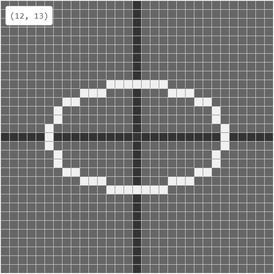

# computer-graphic-exp

## Demo

[Online demo](https://cg.andream.app)

Draw Line with `DDA`, `Middle Point`, `Bresenham`

Draw Circle with `Middle Point`, `Bresenham`

Draw Ellipse with `Middle Point`

Fill Polygon with `Recursively Fill`, `Scan Line Fill`

## Lisence

Apache-2.0
